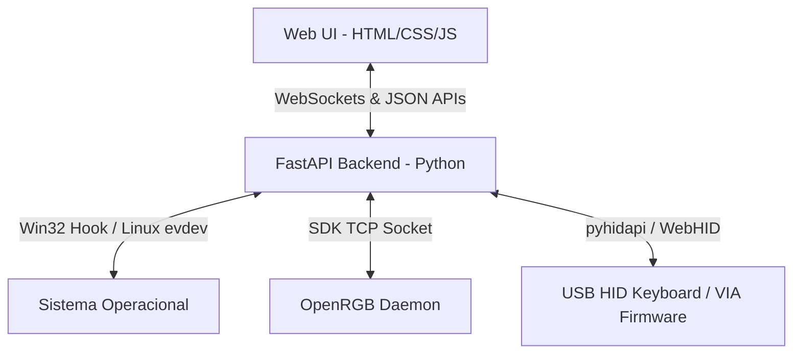

# ⌨️ Antigravity Universal Keyboard Hub

<p align="center">
  
  
  
  
</p>

O **Antigravity Keyboard Hub** é um painel desktop integrado e moderno para controle total de teclados mecânicos e convencionais. Ele unifica em uma única interface Web baseada em *Glassmorphism* os três principais pilares de customização de teclado: **Remapeamento de Teclas em Baixo Nível**, **Controle de Iluminação RGB** (com simulador integrado) e **Exploração/Gravação USB HID via Protocolo VIA**.

---

## 🌟 Funcionalidades Principais

### 1. Remapeador Global de Teclas (Cross-Platform)
Interceptação e re-roteamento de sinais do teclado físico em tempo real:
*   **Windows**: Implementado usando hooks nativos Win32 de baixo nível (`SetWindowsHookExW` com tratamento `LLKHF_INJECTED` para evitar loops de feedback infinitos).
*   **Linux**: Interceptação direta grabando o descritor físico `/dev/input/` usando `evdev` e emulação de teclado virtual no nível do Kernel usando o módulo `uinput`.
*   **Segurança**: Estrutura robusta baseada em threads e blocos `try...finally` que garantem a liberação do seu teclado físico mesmo em caso de travamentos.

### 2. Controle de Iluminação RGB & Efeitos
*   **Integração com OpenRGB**: Sincronização direta via TCP Socket (porta `6742`) para controlar o hardware físico de centenas de teclados de marcas famosas.
*   **Simulador Integrado**: Fallback automático para modo simulação se o daemon OpenRGB não estiver ativo.
*   **Efeitos em Tempo Real**: Estático, Onda Reativa de Cores, Respiração Gradual e Ciclo Arco-íris rodando a 20 FPS através de transmissões assíncronas de matrizes de cores via WebSockets.

### 3. USB HID & Terminal de Firmware (VIA)
*   **Scanner USB**: Varredura de barramento USB usando `hidapi` buscando páginas de uso compatíveis com QMK/VIA (`0xFF60`).
*   **Hex Terminal**: Envio e recepção de pacotes hexadecimais brutos de 32 bytes para leitura e gravação direta na memória EEPROM do teclado.
*   **Simulador VIA**: Resposta fiel a chamadas de protocolo como *Get Version* (`0x01`), *Get Keymap* (`0x11`) e *Set Keymap* (`0x12`), permitindo testes e aprendizado mesmo sem um teclado compatível conectado.

---

## 📐 Arquitetura do Sistema



---

## 📂 Estrutura do Projeto

```
universal-keyboard-controller/
├── backend/
│   ├── main.py              # Inicialização FastAPI, WebSockets e Endpoints
│   ├── remapper.py          # Interceptador multiplataforma (Win32 Hooks / Linux evdev)
│   ├── rgb_controller.py    # Conexão OpenRGB e simulador de efeitos visuais
│   └── hid_explorer.py      # Scanner USB HID e interpretador de comandos VIA
├── frontend/
│   ├── index.html           # Interface do Dashboard
│   ├── style.css            # Estilização Glassmorphism e layout físico 60%
│   └── app.js               # Renderizador do teclado virtual e requisições assíncronas
├── .gitignore               # Arquivos a serem desconsiderados pelo Git
└── README.md                # Documentação do projeto
```

---

## 💻 Instalação & Inicialização

### Pré-requisitos
*   Python 3.10 ou superior instalado.
*   Bibliotecas do Python instaladas:

```bash
pip install fastapi uvicorn pynput
```

### Inicialização no Windows
Como o Windows exige privilégios administrativos para registrar ganchos globais de teclado (`SetWindowsHookExW`), execute o servidor a partir de um prompt CMD ou PowerShell iniciado como **Administrador**:

```powershell
# Vá até a pasta do projeto
cd universal-keyboard-controller\backend

# Execute o servidor
python main.py
```

### Inicialização no Linux
No Linux, o acesso ao `/dev/input/` e ao módulo `/dev/uinput` para criação de teclado virtual exige privilégios de superusuário:

```bash
# Instale a dependência de kernel do Linux
pip install evdev

# Execute o servidor como superusuário
sudo python backend/main.py
```

---

## ⚙️ Configurações Recomendadas

### Sincronizando com o Teclado Físico (RGB)
Para que o software mude fisicamente os LEDs do seu teclado:
1.  Baixe e instale o [OpenRGB](https://openrgb.org/).
2.  Abra o OpenRGB como **Administrador** para que ele detecte o seu hardware.
3.  Vá até a aba **SDK Server** e clique em **Start Server** (deve escutar na porta `6742`).
4.  O painel web se conectará automaticamente e enviará os pacotes de cores.

---

## 📝 Licença

Este projeto está sob a licença [MIT](LICENSE).
